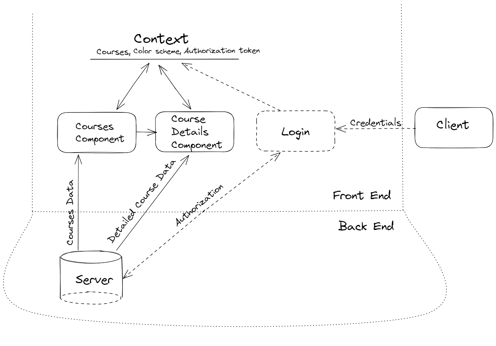

[DEMO LINK](https://kostasburnazaki.github.io/clean-code-principes-kostasburnazaki/)

# App Architecture

# Pagination

I used simple pagination technique that slices the array of courses in accordance with useState parameter, that are being manipulated by Pagination component elements.

# Video

I've used VideoJS player here. On preview section video play is triggered by mouse hover and the same logic for pause the video. Also the video on preview has increased playback rate by default (and muted). Video element inside CourseComponent has control only if the lesson is ulocked, also for locked lessons respective videos has "padlock" previw picture. The progress of the available videos is saved inside localStorage with video player id. Also the player allows to open the video in separate window and move it to the lower right cornen as per requirements of the task. "Allow CORS" application for chrome has been used due to unable to get the video from the server (CORS error).

# Router

Router is used to make it a single page application.

# Test

The received API resonse is checked for errors and format compliance inside api.tsx

# Courses data on CourseComponent

When the CourseComponent is updated by a user the array of courses is requested from the server since it is not received as a property from home page.